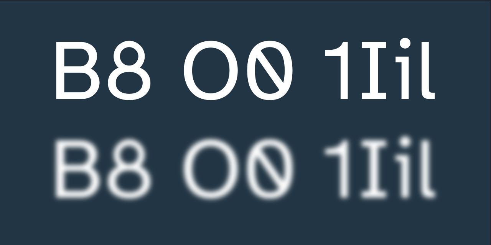

# [Atkinson Hyperlegible Pro](https://jacobxperez.github.io/atkinson-hyperlegible-pro/)

An updated and extended version of [Atkinson Hyperlegible](https://brailleinstitute.org/freefont).

---

## Table of Contents

* [Overview](#overview)
  * [Features](#unique-design-features)
  * [Installing](#installing-the-font)
  * [Language Support](#language-support)
* [Flip the Zero](#flipping-the-zero)
* [Change Log](#change-log)
  * [Kern Log](#kern-log)
  * [Characters and Glyphs](#added-characters-and-glyphs)
* [Contribute](#contribute)
* [License](#license)

## Overview

Atkinson Hyperlegible Pro is an updated and extended version of the original typeface, which was initially designed for The Braille Institute and named after its founder, J. Robert Atkinson. It was specifically designed to improve character recognition and legibility for low-vision readers by incorporating distinctive and unambiguous letterforms. The typeface was a Winner of Fast Company’s 2019 Innovation By Design Award.

* Four fonts, including two weights (regular, italic, bold, bold italic)
* An additional 88 glyphs supporting 90 languages
* 1,820 total glyphs across all fonts, 455 per font
* Improve legibility and readability for low vision readers
* Improve kerning for visual aesthetics
* Includes ligatures for `fi ff ffi fl ffl`
* Alternative reversed number zero `0`

## Unique Design Features

Designed for low-vision readers, certain letters and numbers can be hard to distinguish from one another. Atkinson Hyperlegible Pro differentiates common misinterpreted letters and numbers using various design techniques: B vs. 8, 1 vs. L vs. l vs. I. Recognizable Footprints: Character boundaries are clearly defined, ensuring understanding across the visual-ability spectrum.

> `Q vs G, E vs F, p vs q, i vs r, O vs 0`

Differentiated letterforms: Similar letter pairs are differentiated from each other to dramatically increase legibility. Unambiguous Characters: designed to increase legibility and distinction.

> `ER79jr Vsa36`

Exaggerated forms: Shaping of letters is exaggerated to provide better clarity. Opened Counterspace: Open areas of certain letters are expanded to provide greater distinction.

> `aGbgrpqu Åö8ij%?¡:`

Angled spurs and differentiated tails: Increase recognition and define distinctive style. Circular Details: Links to the history of Braille Institute and braille dots.

## Installing the Font

* **[Download](https://github.com/jacobxperez/atkinson-hyperlegible-pro/archive/refs/heads/main.zip)** the font from this Github repository.
* Extract the file to reveal additional folders inside. Find the Open Type Format (.otf) files for the four Atkinson Hyperlegible Pro fonts (regular, italic, bold, bold italic) inside the “[fonts/otf](https://github.com/jacobxperez/atkinson-hyperlegible-pro/tree/main/fonts/otf)” folder.
* Note: Only the otf files are needed to install the font on a computer.
* On Windows 10: Double-click the font file, then click the “Install” button in the font preview window that opens. The font will be installed. Alternatively, right-click on the file and choose “Install” from the pop-up menu.
* On Mac: Double-click the font file in the Finder, then click “Install Font” in the font preview window that opens. After your Mac validates the font and opens the Font Book app, the font is installed and available for use.

## Language Support

Afrikaans Albanian Asu Basque Bemba Bena Breton Catalan Chiga Colognian Cornish Croatian Czech Danish Dutch Embu English Esperanto Estonian Faroese Filipino Finnish French Friulian Galician German Gusii Hungarian Icelandic Indonesian Irish Italian Kabuverdianu Kalenjin Kamba Kikuyu Kinyarwanda Latvian Lithuanian Lower Sorbian Luo Luxembourgish Luyia Machame Makhuwa-Meetto Makonde Malagasy Maltese Manx Meru Morisyen North Ndebele Norwegian Bokmål Norwegian Nynorsk Nyankole Oromo Polish Portuguese Quechua Romanian Romansh Rombo Rundi Rwa Samburu Sango Sangu Scottish Gaelic Sena Serbian Shambala Shona Slovak Soga Somali Spanish Swahili Swedish Swiss German Taita Teso Turkish Upper Sorbian Uzbek (Latin) Volapük Vunjo Walser Welsh Western Frisian Zulu.

## Flipping the Zero

By default the zero remains as it is however you can flip the zero by adding
`font-variant-numeric: slashed-zero;` to your CSS file.

    body {
      font-size: 100%;
      font-family: "Atkinson Hyperlegible Pro", sans-serif;
      font-weight: 400;
      font-variant-numeric: slashed-zero;
    }

And thats it the zero has been flipped!!

## Change Log

* [Curvatura](https://github.com/linusromer/curvatura): Harmonize the joint tangent-ially for continuous curvature
* Added auto-hint and auto-instruct with fontforge
* Fix t with cedilla `ţ` `U+0163` now showing correct glyph

## Kern Log

* Kern `v` `w` `y` pairs
* Kern `Q` and `U` pairs
* Kern `S` and `T V Y` pairs
* Kern `K` and `c d e o g q` pairs
* Kern `Y` and `c d e o g q m n p r` pairs
* Kern `W` and `c d e o g q m n p r` pairs
* Kern `V` and `c d e o g q m n p r` pairs
* Kern `T` and `c d e o g q m n p r v w x y z` pairs

## Added Characters and Glyphs

* Modifier letter apostrophe `ʼ` `U+02BC`
* U with caron `Ǔ` `U+01D3` and `ǔ` `U+01D4`
* H with caron `Ȟ` `U+021E` and `ȟ` `U+021F`
* A with caron `Ǎ` `U+01CD` and `ǎ` `U+01CE`
* Y with tilde `Ỹ` `U+1EF8` and `ỹ` `U+1EF9`
* Y with macron `Ȳ` `U+0232` and `ȳ` `U+0233`
* G with caron `Ǧ` `U+01E6` and `ǧ` `U+01E7`
* E with tilde `Ẽ` `U+1EBC` and `ẽ` `U+1EBD`
* O with stroke and acute `Ǿ` `U+01FE` and `ǿ` `U+01FF`
* Ae with acute `Ǽ` `U+01FC` and `ǽ` `U+01FD`
* O with breve `Ŏ` `U+014E` and `ŏ` `U+014F`
* L with middle dot `Ŀ` `U+013F` and `ŀ` `U+0140`
* I with breve `Ĭ` `U+012C` and `ĭ` `U+012D`
* I with tilde `Ĩ` `U+0128` and `ĩ` `U+0129`
* E with breve `Ĕ` `U+0114` and `ĕ` `U+0115`
* Hyphen `‐` `U+2010`
* U with tilde `Ũ` `U+0168` and `ũ` `U+0169`
* U with breve `Ŭ` `U+016C` and `ŭ` `U+016D`
* S with circumflex `Ŝ` `U+015C` and `ŝ` `U+015D`
* H with circumflex `Ĥ` `U+0124` and `ĥ` `U+0125`
* G with circumflex `Ĝ` `U+011C` and `ĝ` `U+011D`
* C with circumflex `Ĉ` `U+0108` and `ĉ` `U+0109`
* J with circumflex `Ĵ` `U+0134` and `ĵ` `U+0135`
* Dottles J `ȷ` `U+0237`
* Ligature Ij `Ij` `U+0132` and `ij` `U+0133`
* L with acute `Ĺ` `U+0139` and `ĺ` `U+013A`
* I with dot above `İ` `U+0130`
* O with Macron `Ō` `U+014C` and `ō` `U+014D`
* R with cedilla `Ŗ` `U+0156` and `ŗ` `U+0157`
* T with dot above `Ṫ` `U+1E6A` and `ṫ` `U+1E6B`
* S with dot above `Ṡ` `U+1E60` and `ṡ` `U+1E61`
* P with dot above `Ṗ` `U+1E56` and `ṗ` `U+1E57`
* M with dot above `Ṁ` `U+1E40` and `ṁ` `U+1E41`
* Y with circumflex `Ŷ` `U+0176` and `ŷ` `U+0177`
* Y with grave `Ỳ` `U+1EF2` and `ỳ` `U+1EF3`
* W with circumflex `Ŵ` `U+0174` and `ŵ` `U+0175`
* W with diaeresis `Ẅ` `U+1E84` and `ẅ` `U+1E85`
* W with grave `Ẁ` `U+1E80` and `ẁ` `U+1E81`
* W with acute `Ẃ` `U+1E82` and `ẃ` `U+1E83`
* F with dot above `Ḟ` `U+1E1E` and `ḟ` `U+1E1F`
* D with dot above `Ḋ` `U+1E0A` and `ḋ` `U+1E0B`
* B with dot above `Ḃ` `U+1E02` and `ḃ` `U+1E03`
* Dong `₫` `U+20AB`
* Ligatures for `fi ff ffi fl ffl`
* Copyleft `🄯` `U+1F12F`
* Alternative reversed number zero `0`

## Contribute

Help us improve Atkinson Hyperlegible Pro for everyone, any contribution or feedback is welcome. Before you commit let me know by submitting an [issue](https://github.com/jacobxperez/atkinson-hyperlegible-pro/issues), starting a [discussion](https://github.com/jacobxperez/atkinson-hyperlegible-pro/discussions) or a [pull-request](https://github.com/jacobxperez/atkinson-hyperlegible-pro/pulls). There might be a cupule of [projects](https://github.com/jacobxperez/atkinson-hyperlegible-pro/projects?query=is%3Aopen) that need your help. I am currently working on adding more glyphs to cover the unicode block of “[latin extended additional](https://www.compart.com/en/unicode/block/U+1E00)” this will also include new diacritic and marks.

## License

SIL Open Font License, v1.1. See [LICENSE.txt](LICENSE.txt) for details.

---

Learn more at [brailleinstitute.org/freefont](https://brailleinstitute.org/freefont).
